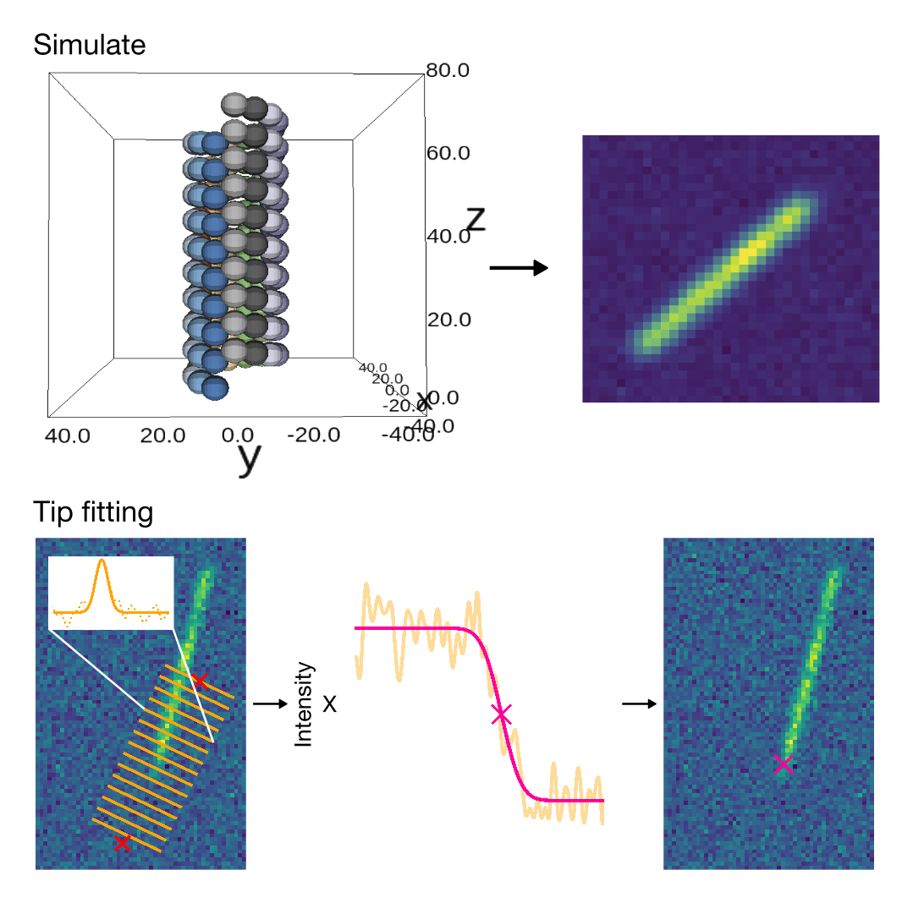

# Anamic

[](https://mybinder.org/v2/gh/brouhardlab/anamic/master?urlpath=lab/tree/notebooks)
[](https://travis-ci.com/brouhardlab/anamic)

Simulate, fit and analyze microtubules.



## Dependencies

- python > 3.6 (please stop using Python 2!)

## Install

The best way is to clone the repository:

```bash
git clone https://github.com/brouhardlab/anamic.git
```

or to use as a library with `pip` (the notebooks won't be available):

```bash
pip install anamic
```

or to get the latest version:

```bash
pip install https://github.com/brouhardlab/anamic/archive/master.zip
```

## License

Under BSD license. See [LICENSE](LICENSE).

## Authors

- Claire Edrington <>
- Hadrien Mary <hadrien.mary@gmail.com>

## Release a new version

- Install [rever](https://regro.github.io/rever-docs): `conda install -y rever`.
- Run check: `rever check`.
- Bump and release new version: `rever VERSION_NUMBER`.
